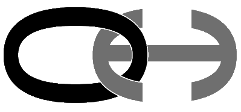

<p align="center"><a href="https://overhide.io"></a></p>


<p align="center"><a href="https://overhide.io">pay2my.app by overhide.io</a></p><p style="width: 500px; margin: auto">A free and open-sourced ecosystem of widgets, a front-end library, and back-end services &mdash; to make addition of "logins" and "in-app-purchases" (IAP) to your app as banal as possible.</p>


<hr/>

# pay2my.app widgets

Customizable web-components enabling login and in-app purchases (IAP, paid up-sells) for any Web application to be as simple as possible.

The web-components are backed by the [legers.js library](https://www.npmjs.com/package/ledgers.js) in the browser and [renumeration APIs](https://overhide.io/2020/09/06/remuneration-api.html) to allow IAP in US dollars, ethers, and bitcoins (easily extensible to other cryptos).

Everything is open-source except for the US dollar microservice.

The authentication and authorization mechanism used herein is the [Ledger-Based Authorizations](https://overhide.io/2020/10/11/what.html): crypto authorization concepts abstracted out for use with US dollars and any ledger based currency.


👁👁  For the impatient, jump to the [demos](#demos).


It's simple to add IAPs to your Web application &mdash;  check out the "simplest" [demo](https://overhide.github.io/pay2my.app/demo-front-end/simplest.html) ([code](/demo-front-end/simplest.html))  &mdash; it's essentially:

```
<html>

    ...

    <script>
      window.addEventListener('pay2myapp-appsell-sku-clicked',(e) => { /* react to feature being used, only if, auth'ed */ });
    </script>

    <pay2myapp-hub id="hub" apiKey="0x___API_KEY_ONLY_FOR_DEMOS_AND_TESTS___" isTest></pay2myapp-hub>      

    <pay2myapp-login hubId="hub"
                    overhideSocialMicrosoftEnabled
                    overhideSocialGoogleEnabled
                    overhideWeb3Enabled
                    ethereumWeb3Enabled
                    bitcoinEnabled
                    overhideSecretTokenEnabled>
    </pay2myapp-login>

    <pay2myapp-appsell hubId="hub" 
                      sku="2-dollar-feature"
                      priceDollars="2"
                      authorizedMessage="Use Feature"
                      unauthorizedTemplate="Add Feature ($${topup})"
                      bitcoinAddress="tb1qr9d7z0es86sps5f2kefx5grpj4a5yvp4evj80z"
                      ethereumAddress="0x046c88317b23dc57F6945Bf4140140f73c8FC80F"
                      overhideAddress="0x046c88317b23dc57F6945Bf4140140f73c8FC80F">
    </pay2myapp-appsell>
    
    ...
    
</html>
```


The above three web-components in an HTML page are all that's needed for the simplest authentication and authorization scenarios &mdash; allowing you to get paid ($2 in the above sample).  The components use the [legers.js library](https://www.npmjs.com/package/ledgers.js) library and [renumeration APIs](https://overhide.io/2020/09/06/remuneration-api.html) to provide all functionality.

Now, of course, the simplest example above is limited, it doesn't use a back-end and all code sits fully decompilable in the browser.  It's useful for some scenarios, but for other scenarios you will want to [re-check authorizations in your back-end code and have feature-flows run through a back-end](https://overhide.io//2019/03/27/authorizations-and-exposed-source-code.html).

Most demos in this repo have business flows incorporating a simple back-end.  The back-end is provided as the [/demo-back-end](/demo-back-end) node.js application &mdash; that also runs in [Azure functions](https://azure.microsoft.com/en-us/services/functions/).  You can base your own back-end off of these samples, it's very little code.


The below infographic conveys at-a-glance what you get with these widgets:

<p align="center"><a href="https://overhide.github.io/pay2my.app/assets/widgets.svg" target="_blank"></a></p>

The top-left shows a sample Web app with a nav-bar housing the [pay2myapp-status](#pay2myapp-status) component.  It also shows three purchase buttons.  Clicking any of these will open up the [pay2myapp-login](#pay2myapp-login-) component which serves as our "login widget".

When a user wants to authorize for a feature; different UI experiences will present themselves depending on whether the feature is free, the user wants to pay in dollars, or the user wants to pay using a wallet, e.g., above, see:

- anti-bot authentication
- purchase for dollars
- puchase with crypto wallet

A logged in user can check their previous payments in new browser tabs &mdash; UI experiences vary by currency/wallet.


> ## Framework Users -- React.js, Angular, Vue.js, ...
>
> These are standard Web components written using [FAST](https://www.fast.design/).
>
> They [can be incorporated into any framework](https://www.fast.design/docs/integrations/introduction).
>
> An example/demo of these components used in a React.js app is provided in its own repository: [pay2my.app React.js Demo app](https://github.com/overhide/pay2my.app-react-demo).


## Quick Start

To use these widgets in your Web app follow the steps below.

Don't just read these steps, follow along copying/looking-at the [demos](#demos).

The first three steps are gathering metadata necessary to setup how you, the developer, get paid.

The remainder of the steps are actual code changes in your Web application.


1. onboard onto the dollar-ledger to get your US-dollar-ledger address ([production](https://ledger.overhide.io/onboard) | [testnet](https://test.ledger.overhide.io/onboard))

   - optional, you don't need this if you just want to accept cryptos or don't want in-app purchases at all (just authentication)
  - but, keep in mind, it's too early to just accept cryptos &mdash; most people online won't have any just yet and it's prudent to give them the option to pay in dollars
   - you will create a new [Stripe](https://stripe.com) account or connect your existing [Stripe](https://stripe.com) account
   - you will provide the above address as the *overhideAddress* attribute in all your [pay2myapp-appsell](#pay2myapp-appsell) components (the feature buttons)

2. onboard onto Ethereum (optional, recommended)

   - use a wallet such as [MetaMask](https://metamask.io/) to generate your credentials
   - you will provide your Ethereum public address as the *ethereumAddress* attribute in all your [pay2myapp-appsell](#pay2myapp-appsell) components

3. onboard onto Bitcoin (optional)

   - use a wallet such as [Electrum](https://electrum.org/#home) to generate your credentials
   - you will provide your Bitcoin public address as the *bitcoinAddress* attribute in all your [pay2myapp-appsell](#pay2myapp-appsell) components

4. pull in the `pay2my.app.js` component into your app, see [CDN](#cdn).

5. add an [pay2myapp-hub](#pay2myapp-hub) component to your DOM or [initialize programatically](#setting-the-pay2myapp-hub-programatically)

   - assign an *id* attribute to the hub if other components will de-reference this hub via their *hubId* attribtues; otherwise, call the *setHub(..)* explicitly on each of those components from script
   - configure the *token* attribute or *apiKey* (see [Enabling with Token](#enabling-with-token))
   - specify the *isTest* attribute if this is a testnet application, otherwise leave it out

6. add an [pay2myapp-login](#pay2myapp-login) component to your DOM

   - configure the *id* of the [pay2myapp-hub](#pay2myapp-hub) element via the *hubId*, or call this elements's *setHub(..)* setter to set the hub element programatically
   - list all the desired authentication/authorization methods for this application, the various *overhide..Enabled* attributes in [pay2myapp-login](#pay2myapp-login)
     - *overhideSocialMicrosoftEnabled* if you want Microsoft social-login against the US dollar ledger &mdash; must onboard step [1] above and specify *overhideAddress* in your [pay2myapp-appsell](#pay2myapp-appsell) elements
     - *overhideSocialGoogleEnabled* if you want Google social-login against the US dollar ledger &mdash; must onboard step [1] above and specify *overhideAddress* in your [pay2myapp-appsell](#pay2myapp-appsell) elements
     - *overhideWeb3Enabled* if you want customers to manage their US dollar ledger credentials with their Ethereum wallet such as [MetaMask](https://metamask.io/)  &mdash; must onboard step [1] above and specify *overhideAddress* in your [pay2myapp-appsell](#pay2myapp-appsell) elements
     - *ethereumWeb3Enabled* if you want to allow payments in ethers for customers with their Ethereum wallet such as [MetaMask](https://metamask.io/)  &mdash; must onboard step [2] above and specify *ethereumAddress* in your [pay2myapp-appsell](#pay2myapp-appsell) elements
     - *bitcoinEnabled* if you want to allow payments in bitcoins for customers with their Bitcoin wallet such as [Electrum](https://electrum.org/#home)  &mdash; must onboard step [3] above and specify *bitcoinAddress* in your [pay2myapp-appsell](#pay2myapp-appsell) elements
     - *overhideSecretTokenEnabled* if you want user-managed secret-token access against the US dollar ledger &mdash; must onboard step [1] above and specify *overhideAddress* in your [pay2myapp-appsell](#pay2myapp-appsell) elements

7. add an [pay2myapp-appsell](#pay2myapp-appsell) component as an explicit "login" button (non-feature) to your DOM

   1. optional, as the feature buttons &mdash; when clicked &mdash;  will login your users if they're not yet logged in
   2. configure the *id* of the [pay2myapp-hub](#pay2myapp-hub) element via the *hubId*, or call this elements's *setHub(..)* setter to set the hub element programatically
   3. do not provide any [pay2myapp-appsell](#pay2myapp-appsell) attributesexcept for the *hubId* (above) and the *loginMessage*

8. add [pay2myapp-appsell](#pay2myapp-appsell) components to your DOM for each feature

   1. configure the *id* of the [pay2myapp-hub](#pay2myapp-hub) element via the *hubId*, or call this elements's *setHub(..)* setter to set the hub element programatically
   2. provide a unique *sku* attribute per button
   3. provide the desired *priceDollars* attribute, or 0 if setting up a for-free feature
   4. provide the *authorizedMessage* attribute to be displayed when user is already authorized and just needs to click on the feature to enable / use
   5. provide the *unauthorizedTemplate* attribute to be displayed when the user is not yet authorized to use the feature (insufficient funds, not auth'ed)
   6. provide the *overhideAddress* attribute if onboarded for US dollar payments in step [1] above
   7. provide the *ethereumAddress* attribute if onboarded for ethers payments in step [2] above
   8. provide the *bitcoinAddress* attribute if onboarded for bitcoin payments in step [3] above

## Demos

We have several component demo files in [/demo-front-end](/demo-front-end):

| **Demo Name**                                                | **Link**                                                     | **Code**                                                     | **Uses Back-End** | **Notes**                                                    |
| ------------------------------------------------------------ | ------------------------------------------------------------ | ------------------------------------------------------------ | ----------------- | ------------------------------------------------------------ |
| basic                                                        | [demo](https://overhide.github.io/pay2my.app/demo-front-end/basic.html) | [code](/demo-front-end/basic.html)                           | ✔                 | the basic demo &mdash; *pay2myapp-status* in the nav-bar, a login button, 3 feature buttons. |
| no back-end                                                  | [demo](https://overhide.github.io/pay2my.app/demo-front-end/no-back-end.html) | [code](/demo-front-end/no-back-end.html)                     | ✖                 | a no  [back-end](#back-end) demo, everything just in-browser &mdash; same as basic otherwise |
| custom buttons                                               | [demo](https://overhide.github.io/pay2my.app/demo-front-end/custom.html) | [code](/demo-front-end/custom.html)                          | ✔                 | same as basic demo but the login button has different colors and the feature buttons are ice cream desserts &mdash; see [slots](#slots-2) section of the [pay2myapp-appsell](#pay2myapp-appsell) component below |
| javascript-hub                                               | [demo](https://overhide.github.io/pay2my.app/demo-front-end/javascript-hub.html) | [code](/demo-front-end/javascript-hub.html)                  | ✔                 | same as basic demo but the *pay2myapp-hub* component is not in the DOM, it's wired in via script |
| simplest                                                     | [demo](https://overhide.github.io/pay2my.app/demo-front-end/simplest.html) | [code](/demo-front-end/simplest.html)                        | ✖                 | bare bones single button demo &mdash; the simplest demo, no [back-end](#back-end) |
| <br /><br />[pay2my.app React.js Demo app](https://github.com/overhide/pay2my.app-react-demo) | [demo](https://github.com/overhide/pay2my.app-react-demo) | [code](https://github.com/overhide/pay2my.app-react-demo) | ✔                 | React.js version of these demos.                             |


Most demos show:

- a nav-bar at the top with an [pay2myapp-status](#pay2myapp-status) web-component flush to the right.
- a login button (which is just an [pay2myapp-appsell](#pay2myapp-appsell) component with a *loginMessage* attribute instead of a *sku*)
- 3 feature buttons ([pay2myapp-appsell](#pay2myapp-appsell) components):
  - free
  - $2 up-sell
  - $3 subscription for 30 minutes

Everything is optional except for the non-visible [pay2myapp-hub](#pay2myapp-hub)  web-component that can be wired via DOM or JavaScript (see the [javascript-hub demo](/demo-front-end/javascript-hub.html) for JS wiring).

You could just have a single up-sell / in-app purchase button, no status, no explicit login, and it will allow all the functionality (see "simplest"  [demo](https://overhide.github.io/pay2my.app/demo-front-end/simplest.html) ([code](/demo-front-end/simplest.html)).


The [/demo-front-end/no-back-end.html](/demo-front-end/no-back-end.html) shows the use of these widgets without any back-end &mdash; shows use of widgets with just an API key, the back-end setup can be ignored for this one.  This is OK for some projects, but is less bad-actor proof.  All other demos leverage a back-end.

##### Back-End

Most demos run their feature-flows via our  [/demo-back-end](/demo-back-end): when a user clicks a feature, the back-end is interrogated to complete the feature flow.  

Note that the back-end verifies authentication and authorization as per credentials provided and monies paid on a ledger of choice.

The back-end serves three purposes on behalf of our front-ends:

- retrieves [an overhide token](https://token.overhide.io/swagger.html) for use with *overhide* APIs &mdash; browser front-end code calls this to get the token and provide to the [pay2myapp-hub](#pay2myapp-hub)  component.
- retrieves the fees-schedule (not actually leveraged in demos for simplicity, but provided for completness)
  - usually you'll want a single source of truth for your feature fees schedule
- runs the feature-flow business logic on the back-end when corresponding feature button clicked in the front-end (`/RunFeature` endpoints)
  - has a bunch of mandatory `query` parameters to authenticate and authorize
  - feature will not run if bad authentication or insufficient funds on ledger for feature (as per parameters): will result in "Unauthorized by Ledger-Based AuthZ-" response.
  - the back-end calls [overhide APIs](https://overhide.io/2020/09/06/remuneration-api.html) to check authorizations, and requires the following pieces of information from  the front-end (the `/RunFeature` query parameters):
    - *sku* &mdash; the feature name / tag to derefernce fees schedule
    - *currency* &mdash; one of 'dollars', 'ethers', 'bitcoins'
    - *from* &mdash; ledger specific address of the customer (the 'from')
    - *message* &mdash; message signed to prove ownership of *address* (NOTE, this is base64 encoded)
    - *signature* &mdash; signature of *message* for *from*
    - *isTest* &mdash; whether testnet ledgers should be used for authorization

The endpoints for these are discussed in the [Local Development](#local-development) section below.


The [/demo-back-end](/demo-back-end) code runs both as stand-alone *node.js* as well as on  [Azure Functions](https://azure.microsoft.com/en-us/services/functions/) (instructions below in [Local Development](#local-development) section).  

All of the above demos &mdash; with the exception of the *no-back-end* and *simplest* demos &mdash; hit this back-end code as it is stood up at https://demo-back-end.azurewebsites.net/api on Azure; but, it's easy enough to stand-up locally and play around (again, see [Local Development](#local-development) below).

## Distributable

> **⚠ Why is it so big?** 
>
> We depend on [web3.js](https://github.com/ethereum/web3.js/) which has bloat issues:
>
> https://github.com/ChainSafe/web3.js/issues/1178
>
> As soon as that gets resolved, this distro will be smaller.

The *pay2my.app* 'dist' folder contains the distributable artifact.

You'll likely want to [import](https://developer.mozilla.org/en-US/docs/Web/JavaScript/Reference/Statements/import) the library in your script code.

Within your front-end projects; using *npm* simply:  `npm install pay2my.app --save-prod`.

#### Enabling with Token

APIs abstracted by *pay2my.app* require a bearer-token.  The `token` is passed in to the `<pay2myapp-hub token="..">` component (see the [pay2myapp-hub](#pay2myapp-hub) component section for details).

The component either takes a `token=".."` retrieved from a back-end (optional) or an `apiKey=".."` provided statically &mdash; less bad-actor proof, but OK for some projects.

Retrieve an API key from https://token.overhide.io/register.

After that, a token can be retrieved with a `GET /token` call (see https://token.overhide.io/swagger.html).

All demos below show one or the other.

## CDN

You can include *pay2my.app* via CDN:

* `https://cdn.jsdelivr.net/npm/pay2my.app@1.1.2/dist/pay2my.app.js`

You can see all the [/demo-front-end/*.html](/demo-front-end) demos load it this way:

```
<script src="https://cdn.jsdelivr.net/npm/pay2my.app@1.1.2/dist/pay2my.app.js"></script>
```

In our demos we specifically load the latest version, e.g. version *1.1.2*: `https://cdn.jsdelivr.net/npm/pay2my.app@1.1.2/dist/pay2my.app.js`

The widgets can then be used in your DOM and via your framework JavaScript.


In [npm](https://www.npmjs.com/) based app projects, include the components and TypeScript definitions with your `package.json`:

```
"dependencies": {
  ..
  "pay2my.app": "1.1.2",
  ..
}
```


## Widget Reference

Below is a reference of the four web-components provided, their attributes, properties, events, and override [slots](https://developer.mozilla.org/en-US/docs/Web/HTML/Element/slot) for customizing.

### `<pay2myapp-hub ..>`

The *pay2myapp-hub* comopnent is the main glue component of the whole subsystem.  

There can be only one *pay2myapp-hub* shared by all the other components.

Each other component must be provided with an *pay2myapp-hub* either via the DOM or programatically.

##### Setting the *pay2myapp-hub* via DOM

Simply set an ID on the *pay2myapp-hub* component and pass it into the other components as the `hubId` attribute:

```
<pay2myapp-hub id="demo-hub" ...></pay2myapp-hub> 

<pay2myapp-appsell 
  hubId="demo-hub" 
  ...
</pay2myapp-appsell>
```

With this setup, if we're providing our API key right in the client code, just set the *apiKey* attribute on the *pay2myapp-hub* element (a la [no-back-end](/demo-front-end/no-back-end.html) and [simplest](/demo-front-end/simplest.html) demos).

Otherwise, provide the *pay2myapp-hub* element with a token as per all the other demos, repeated below:

```
<script>
  // Set the token from back-end
  window.onload = (event) => {
  fetch(`${BACKEND_CONNECTION_STRING}/GetToken`)
    .then(async (response) => {
      if (response.ok) {
        const hub = document.querySelector('#demo-hub');
        hub.setAttribute('token', await response.text());
      } else {
        console.error(`error talking to back-end &mdash; ${response.status} &mdash; ${response.statusText}`);
      }
    }).catch(e => console.error(`error talking to back-end &mdash; ${e}`));
  };
</script>
```

- the wiring above is in response to retrieving [a valid token](#enabling-with-token) from the back-end &mdash; the `fetch`
- we set the *token* on the hub using `setAttribute('token',..)`
- the `BACKEND_CONNECTION_STRING` points at our back-end server (see [Target a Back-End](#target-a-back-end) section)

##### Setting the *pay2myapp-hub* Programatically

Get an instance of the *pay2myapp-hub* component by instantiating in JavaScript (`document.createElement('pay2myapp-hub')`) or grabbing from the *document* (`document.querySelector(..)`).

Provide it into each component using the `setHub(..)` setter via ES6 / TypeScript class.

Take a look at the [javascript-hub demo code](/demo-front-end/javascript-hub.html) ([demo](https://overhide.github.io/pay2my.app/demo-front-end/javascript-hub.html)).

Here, the components wired into the DOM do not have a `hubId=..` attribute specified.  There is no `<pay2myapp-hub id=..>` component in the template.  Everything is done in the `window.onload`:

```
<script>
  // Set the token from back-end
  window.onload = (event) => {
  fetch(`${BACKEND_CONNECTION_STRING}/GetToken`)
    .then(async (response) => {
      if (response.ok) {            
        const hub = document.createElement('pay2myapp-hub'); 
        hub.setAttribute('token', await response.text());
        hub.setAttribute('isTest', true);
        hub.init();
        document.querySelector('pay2myapp-login').setHub(hub);
        document.querySelector('pay2myapp-status').setHub(hub);
        document.querySelectorAll('pay2myapp-appsell').forEach(e => e.setHub(hub));
      } else {
        console.error(`error talking to back-end -- ${response.status} &mdash; ${response.statusText}`);
      }
    }).catch(e => console.error(`error talking to back-end -- ${e}`));
  };
</script>
```

- the wiring above is in response to retrieving [a valid token](#enabling-with-token) from the back-end &mdash; the `fetch`
- we set the *token* on the hub using `setAttribute('token',..)`
- the `BACKEND_CONNECTION_STRING` points at our back-end server (see [Target a Back-End](#target-a-back-end) section)
- we optionally set the *isTest* attribute
- since we're not wiring the *pay2myapp-hub* component into the DOM, we explicitly call `hub.init()`
- the remaining `document.querySelector..` calls find all the other pay2my.app web-components to set the newly initialized hub against them via their `setHub(..)` method

##### 

##### Attributes

*isTest*

- set on element to indicate that all transactions/checks should be done against testnets
- leave out if production / live environment

*apiKey*

- set on element if not providing a token but providing the *apiKey*
- we do this in the [no-back-end](/demo-front-end/no-back-end.html) and [simplest](/demo-front-end/simplest.html) demos only &mdash; demos where we do not leverage a back-end
- this allows anyone to see your *apiKey*; in the future we might throttle/black-list basedon *apiKey* (we don't as of yet)

*token*

- set on element to provide a token retrieved via your own back-end
- most demos do this, see code exaple in [section](#setting-the-pay2myapp-hub-via-dom) above
- it's preferred&mdash; but not strictly necessary &mdash; to have this indirection in case we start throttling by *apiKey* in the future: this way your *apiKey* is not shared

##### Properties / Methods

See *IPay2MyAppHub* in [/src/components/hub/definitions.ts](/src/components/hub/definitions.ts).

##### Slots

N/A &mdash; this is an invisible element and not customizable via slots.

##### Events

*pay2myapp-hub-sku-authorization-changed*

- see *IPay2MyAppSkuAuthorizationChangedEvent* in [/src/components/hub/definitions.ts](/src/components/hub/definitions.ts)

```
export interface IPay2MyAppSkuAuthorizationChangedEvent {
  sku: string,
  isAuthorized: boolean;
}
```

- indicated a change in authorization status

*pay2myapp-hub-pending-transaction*

- see *IPay2MyAppPendingTransactionEvent* in [/src/components/hub/definitions.ts](/src/components/hub/definitions.ts)

```
export interface IPay2MyAppPendingTransactionEvent {
  isPending: boolean;
  currency: string | null;
}
```

- fired when we have a pending transaction. We're waiting for a transaction to finish. 
- this should be useful for spinners on custom pay2myapp-appsell components.
- see use in [demos](#demos) when showing the [VISA instructional helper](/dem=o-front-end/assets/visa.png)

```
// This event fires whenever we're asked to topup funds.
// We're using it here to show the VISA instructional helper image.
window.addEventListener('pay2myapp-hub-pending-transaction',(e) => { 
  console.log(`pending-transaction :: ${JSON.stringify(e.detail, null, 2)}`);
  if (e.detail.currency == 'dollars') {
    document.querySelector("#visa").style.opacity = e.detail.isPending ? "1" : "0";
  }
}, false);
```


### `<pay2myapp-login ..>`

The login widget.

The login providers you want to make available to your users can be customized here.

This component must be in your DOM, the other components such as [pay2myapp-appsell](#pay2myapp-appsell) and [pay2myapp-status](#pay2myapp-status) will trigger this component to raise a modal showing login providers &mdash; when necessary.

All login providers configured here should have corresponding addresses configured on all your [pay2myapp-appsell](#pay2myapp-appsell) buttons.

##### Attributes

*hubId*

- connect to the one and only hub shared among all components in this eco-system
- this is the actual element ID of the [pay2myapp-hub](#pay2myapp-hub) in the document model
- if the [pay2myapp-hub](#pay2myapp-hub) is not in the DOM or doesn't have an ID, you'll need to use the `setHub(..)` method (see [setting the hub programatically](#setting-the-pay2myapp-hub-programatically)).

*overhideSocialMicrosoftEnabled*

- if set on the element, enables US dollar ledger login / IAPs via Microsoft account social-login


- requires that your [pay2myapp-appsell](#pay2myapp-appsell) components specify your *overhideAddress* attribute (you're onboarded onto the pay2myapp-ledger)

*overhideSocialGoogleEnabled*

- if set on the element, enables US dollar ledger login / IAPs via Google account social-login


- requires that your [pay2myapp-appsell](#pay2myapp-appsell) components specify your *overhideAddress* attribute (you're onboarded onto the pay2myapp-ledger)

*ethereumWeb3Enabled*

- if set on the element, enables Ethereum ledger login / IAPs via ethereum wallet such as [MetaMask](https://metamask.io/)


- requires that your [pay2myapp-appsell](#pay2myapp-appsell) components specify your *ethereumAddress* attribute (you're onboarded onto the pay2myapp-ledger)

*bitcoinEnabled*

- if set on the element, enables Bitcoin ledger login / IAPs via bitcoin signing


- requires that your [pay2myapp-appsell](#pay2myapp-appsell) components specify your *bitcoinAddress* attribute (you're onboarded onto Bitcoin)

*overhideSecretTokenEnabled*

- if set on the element, enables US dollar ledger login / IAPs via secret token


- requires that your [pay2myapp-appsell](#pay2myapp-appsell) components specify your *overhideAddress* attribute (you're onboarded onto the pay2myapp-ledger)

##### Properties / Methods

See *IPay2MyAppLogin* in [/src/components/hub/definitions.ts](/src/components/hub/definitions.ts).

##### Slots

*closeButton*

- the slot representing the little close button on the login modal
- can be hidden or re-styled


*header*

- allows creating a header at the top of the login modal &mdash; no header by default
- see custom buttons [demo](https://overhide.github.io/pay2my.app/demo-front-end/custom.html) ([code](/demo-front-end/custom.html)) for example, e.g.

```
  <pay2myapp-login ..>
	<div slot="header" class="header-envelope">
	  
	  <div class="headers">
		<div class="header">Custom Login</div>
		<div>(logo + no <em>Google</em> or <em>bitcoin</em>)</div>
	  </div>
	</div>
  </pay2myapp-login>
```


##### Events

*pay2myapp-login-open*

- emited on modal open

*pay2myapp-login-close*

- emited on modal close

### `<pay2myapp-appsell ..>`

The main buttons that enable authorized features in your application.

Clicking on a feature button when not logged in causes login unless the *inhibitLogin* attribute is specified.

Clicking on a feature that isn't authorized triggers the authorization flow (in-app purchase).

Clicking on a feature that's authorized raises the *pay2myapp-appsell-sku-clicked* event in response to which the feature-flow can continue to your back-end and be re-verified (for authorizations).

These widgets are fully customizable through [slots](https://developer.mozilla.org/en-US/docs/Web/HTML/Element/slot).

##### Attributes

*hubId*

- connect to the one and only hub shared among all components in this eco-system
- this is the actual element ID of the [pay2myapp-hub](#pay2myapp-hub) in the document model
- if the [pay2myapp-hub](#pay2myapp-hub) is not in the DOM or doesn't have an ID, you'll need to use the `setHub(..)` method (see [setting the hub programatically](#setting-the-pay2myapp-hub-programatically)).

*orientation*

- the customization slots in this element are by default in a vertical orientation, top-to-bottom
- set this to 'horizontal' if the slots are to be oriented left-to-right

*sku*

- a unique name for the feature being authorized using this button

*priceDollars*

- US dollars and cents as the cost of this feature
- the amount is always specified in US dollars, the system converts to necessary ethers or bitcoins

*loginMessage* 

- if this button is supposed to be an overall login button and never be used for a feature, specify this message
- if this message is specified, do not specify any other attributes other than the *hubId*
- this message is shown in the *authorized-button* and *unauthorized-button* slots

*alwaysLogin*

- if this button should always show the login modal when clicked
- set to true when no means to logout is provided &mdash; enables user to always choose authorization method
- likely shouldn't be set if a button with *loginMessage* is provided or an [pay2myapp-status](#pay2myapp-status) component is used in the page &mdash; as those buttons allow re-login
- useful for donation buttons when they're the sole button on the page

*authorizedMessage*

- the button label to show in the *authorized-button* slot when this feature is authorized

*unauthorizedTemplate*

- the button label to show in the *unauthorized-button* slot when this feature is not yet authorized
- the `${topup}` placeholder can be used in the template to show the outstanding amount of US dollars &mdash; how much the user need to pay to authorize

*inhibitLogin*

- if provided on the element, do not allow the user to login using this button when clicked, and the user is not yet logged in
- this is useful if you do not want users to login using the feature buttons, only an explicit *pay2myapp-appsell* button with a *loginMessage* attribute set

*bitcoinAddress*

- the bitcoin address into which paid bitcoins are deposited &mdash; and which is checked for sufficient monies paid to authorize
- ⚠ do not have too many distinct bitcoin addresses in your rendered route / page
  - usually it's recommended you have one per rendered route (e.g. hitting F5 will cause a single request)
  - all addresses are checked for topups and the APIs are rate-limited per IP
  - your users will start getting [429 - Too Many Requests](https://developer.mozilla.org/en-US/docs/Web/HTTP/Status/429) if too many addresses are provided and they're all checked on refresh

*ethereumAddress*

- the ethereum address into which paid ethers are deposited &mdash; and which is checked for sufficient monies paid to authorize
- ⚠ do not have too many distinct ethereum addresses in your rendered route / page
  - usually it's recommended you have one per rendered route (e.g. hitting F5 will cause a single request)
  - all addresses are checked for topups and the APIs are rate-limited per IP
  - your users will start getting [429 - Too Many Requests](https://developer.mozilla.org/en-US/docs/Web/HTTP/Status/429) if too many addresses are provided and they're all checked on refresh

*overhideAddress*

- the US dollars ledger address which shows receipts for deposited payments &mdash; and which is checked for sufficient monies paid to authorize
- ⚠ do not have too many distinct overhide addresses in your rendered route / page
  - usually it's recommended you have one per rendered route (e.g. hitting F5 will cause a single request)
  - all addresses are checked for topups and the APIs are rate-limited per IP
  - your users will start getting [429 - Too Many Requests](https://developer.mozilla.org/en-US/docs/Web/HTTP/Status/429) if too many addresses are provided and they're all checked on refresh

*withinMinutes*

- specifies the number of minutes the feature should be authorized once sufficient *priceDollars* is paid
- this is useful for subscription features
- in our demos we usually have one button that expires after 30 minutes
- leave out for indefinite &mdash; default

See *IPay2MyAppAppsell* in [/src/components/hub/definitions.ts](/src/components/hub/definitions.ts).

##### Slots

These elements have three slots for authorized  versions of each button and three slots for unauthorized versions of each button.

The authorized versions are shown when sufficient monies have been paid to authorize the feature.

The authorized slots are:

- *authorized-header*
- *authorized-button*
- *authorized-footer*

The unauthorized slots are:

- *unauthorized-header*
- *unauthorized-button*
- *unauthorized-footer*

By default nothing is rendered in the *-header* or the *-footer* slots, all rendering is done in the *-button* slot.  E.g. the various messages from the attributes are rendered in the *authorized-button* or *unauthorized-button*.

The content of the *authorized-button* and *unauthorized-button* slots are overwritten by the *loginMessage*, *authorizedMessage* and *unauthorizedTemplate* attributes.  These slots are only useful for styling the messages.  To modify the look and feel beyond that, use the *-header* and *-footer* slots.

See the [custom buttons demo](https://overhide.github.io/pay2my.app/demo-front-end/custom.html) ([code](/demo-front-end/custom.html)) for examples.

##### Events

*pay2myapp-appsell-sku-clicked*

- see *IPay2MyAppSkuClickedEvent* in [/src/components/hub/definitions.ts](/src/components/hub/definitions.ts)

```
 export interface IPay2MyAppSkuClickedEvent {
  sku: string,
  message: string,
  signature: string,
  from: string,
  to: string,
  currency: Currency,
  isTest: boolean,
  asOf: string
}
```

- the event fired by an pay2myapp-appsell component when an appsell SKU deemed authorized by overhide is clicked by the user
- usually safest to route state-changes in response to this event via a back-end &mdash; and let the back-end re-validate authorizations
- all necessary information to validate is provided in this event
- ⚠ passing the `asOf` timestamp to your back-end &mdash; and having your back-end pass this value to [overhide APIs](https://overhide.io/2020/09/06/remuneration-api.html) when checking authorizations &mdash; is an important optimization. Since the *overhide* services already recently checked these transactions as part of this front-end work; the `asOf` timestamp ensures we re-load these resutls from cache and do not get rate-limited in the back-end.
- example:

```
    <script>
      window.addEventListener('pay2myapp-appsell-sku-clicked',(e) => { /* react to feature being used, only if, auth'ed */ });
    </script>
```

*pay2myapp-appsell-topup-outstanding*

- see *IPay2MyAppSkuTopupOutstandingEvent* in [/src/components/hub/definitions.ts](/src/components/hub/definitions.ts)

```
export interface IPay2MyAppSkuTopupOutstandingEvent {
  sku: string,
  topup: number
}
```

- an event fired by an pay2myapp-appsell component when there was an authorization attempt but insufficient funds to authorize
- this even contains the outstanind topup funds required: in US dollars

### `<pay2myapp-status ..>`

A very simple widget usually provided in the nav-bar of an application.

Shows the currently logged in address and against which login provider (icon).

Allows manually refreshing payments and a logout button.

When logged in, clicking the address shows a transaction history.

When logged out, clicking the "sign-in" text triggers login.

##### Attributes

*hubId*

- connect to the one and only hub shared among all components in this eco-system
- this is the actual element ID of the [pay2myapp-hub](#pay2myapp-hub) in the document model
- if the [pay2myapp-hub](#pay2myapp-hub) is not in the DOM or doesn't have an ID, you'll need to use the `setHub(..)` method (see [setting the hub programatically](#setting-the-pay2myapp-hub-programatically)).

##### Properties / Methods

See *IPay2MyAppStatus* in [/src/components/hub/definitions.ts](/src/components/hub/definitions.ts).

##### Slots

N/A

##### Events

N/A

### Local Development

#### Target a Back-End

As mentioned in the [Demos](#demos) section, we have several component demo files in [/demo-front-end](/demo-front-end).

Each HTML file has a script constant `BACKEND_CONNECTION_STRING` which points at one of the back-end instances, either:

- https://demo-back-end.azurewebsites.net/api (default)
- http://localhost:8100 (local node.js server)
- http://localhost:7071/api (local AZ function server)

Modify this constant as needed.

#### Run a Demo Back-End

> ⚠ The [/demo-front-end/no-back-end.html](/demo-front-end/no-back-end.html) doesn't use a back-end &mdash; shows use of widgets without a back-end, the back-end setup can be ignored for this one.

The [./demo-back-end](./demo-back-end) folder has all the code for a minimal back-end, whether it runs using node.js locally on your development machine or as an [Azure Function](https://azure.microsoft.com/en-us/services/functions/) (how these demos are hosted).

To start running the back-end on your local development machine:

1. prerequesites:
   - node.js
1. open a console to the [./demo-back-end](./demo-back-end) subfolder of this repo
1. `npm install`
1. `npm run dev`

The backend is now running.

You can try hitting it with:

- http://localhost:8100/GetSchedule -- this is the demo's fees schedule.
- http://localhost:8100/GetToken -- provides the [overhide token](https://token.overhide.io/swagger.html) for use with `<pay2myapp-hub ..>` component.
- There is also the main `http://localhost:8100/RunFeature` endpoint is used by the demo front-ends (see [/demo-front-end/index.js](/demo-front-end/index.js)).

Alternativelly, if you want to leverage the [Azure Function](https://azure.microsoft.com/en-us/services/functions/) core tooling:

1. prerequesites:
   - node.js
   - Azure Functions core tools:  `npm install -g azure-functions-core-tools@3 --unsafe-perm true`
1. open a console to the [./demo-back-end](./demo-back-end) subfolder of this repo
1. `npm install`
1. `func start`

The you can try hitting the local AZ functions with:

- http://localhost:7071/api/GetSchedule -- this is the demo's fees schedule.
- http://localhost:7071/api/GetToken -- provides the [overhide token](https://token.overhide.io/swagger.html) for use with `<pay2myapp-hub ..>` component.
- There is also the main `http://localhost:7071/api/RunFeature` endpoint is used by the demo front-ends (see [/demo-front-end/index.js](/demo-front-end/index.js)).


> ASIDE: deploying to [Azure Functions](https://azure.microsoft.com/en-us/services/functions/): 
>
> if you followed the latter, you can deploy to Azure using:
>
> ```
> az login
> func azure functionapp publish <function name>
> ```
>
> Then you can hit the functions in Azure, for example, for this demo's name of `demo-back-end` we have:  
>
> - https://demo-back-end.azurewebsites.net/api/getschedule -- this is the demo's fees schedule.
> - https://demo-back-end.azurewebsites.net/api/gettoken -- provides the [overhide token](https://token.overhide.io/swagger.html) for use with `<pay2myapp-hub ..>` component.
> - There is also the main `https://demo-back-end.azurewebsites.net/api/RunFeature` endpoint is used by the demo front-ends (see [/demo-front-end/index.js](/demo-front-end/index.js)).

